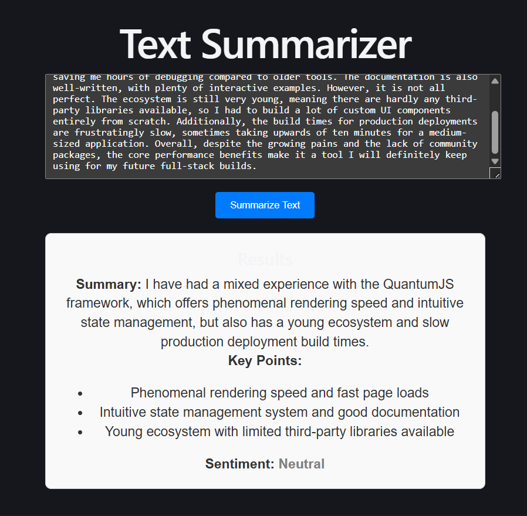

# AI Text Summarizer

A minimal full-stack application that takes unstructured text and returns a structured summary (summary, key points, and sentiment) using the Groq API. 

This was built in about 1-2 hours for the AI Developer Intern assignment.

## Setup & Running Locally

You'll need Node.js installed. I split this into a standard client/server architecture.

**1. Set up the Backend**
Open a terminal and run:
```bash
cd server
npm install

Create a .env file in the server directory (you can copy .env.example). You will need a Groq API key:
PORT=5000
GROQ_API_KEY=your_key_here

Start the server:
node index.js

2. Set up the Frontend
Open a second terminal and run:
cd client
npm install
npm run dev
The app will be running at http://localhost:5173.

Architecture & API Choice
I chose a React (Vite) frontend and a Node.js/Express backend.
While I could have just built a pure React app to save time, calling LLM APIs directly from the browser exposes the API key. Spinning up a tiny Express server to act as a proxy was the safest trade-off.

For the LLM, I used Groq (specifically the llama-3.3-70b-versatile model).

Why Groq? It is incredibly fast and free for development.

Why this model? The previous 8b model was decommissioned, and 70b handles structured JSON extraction very reliably. Groq also offers an OpenAI-compatible SDK, which made the integration standard and clean.

Prompt Design
Getting an LLM to return only JSON and no conversational filler ("Here is your summary...") can be annoying.
To handle this, my system prompt does three things:

Sets the role: "You are an assistant that converts unstructured text into a strict JSON summary."

Defines the exact shape: I provided a literal JSON template in the prompt.

Sets strict boundaries: I explicitly told it "do not include markdown" and "summary must be exactly one sentence."

Combined with Groq's response_format: { type: "json_object" }, this practically guarantees the frontend won't crash trying to parse a bad string.

Trade-offs & Shortcuts
Since this was a timeboxed 1-2 hour assignment, I had to cut some corners:

Barebones UI: I didn't spend time on Tailwind or complex CSS. The UI is just standard HTML elements with inline styles to keep the focus on the core functionality.

Basic Error Handling: The app catches empty inputs and basic API failures, but it doesn't have advanced retry logic or timeout handling.

No Database: Results aren't saved anywhere. Once you refresh, the data is gone.

If I Had More Time...
File Uploads: Pasting text is fine, but parsing a .txt or .pdf file directly would be a much better user experience.

Dynamic Schemas: It would be cool to let the user define the JSON structure they want (e.g., asking for 5 key points instead of 3, or extracting named entities).

Copy to Clipboard: Adding a quick button to copy the raw JSON output for developers to use elsewhere.

Example Output
